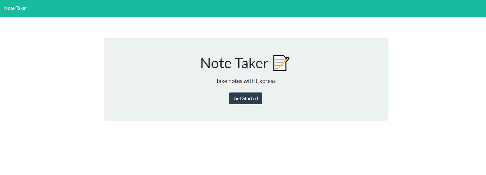
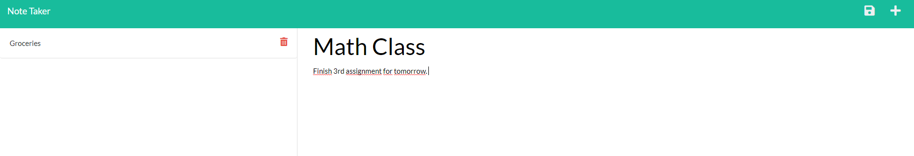

# Note Taker

## Description

- What was your motivation?  
  It is an app that keeps your notes organized, and easy to come back to. They will be stores to either modify or add as many as you want

- Why did you build this project?  
  To easily write down important notes, reminders, or upcoming tasks

- What problem does it solve?  
  The need for a notebook or agenda, you ca access it from any device and not carry a notebook

- What did you learn?  
  How to efficiently connect the back end with the front end requests, as well as manage the information fetched from the API
   
- Briefly describe your Project:  
  Note Taker presents you with a homepage, where later you can click to get to the functionality. A title and description for the note can be added, and upon finishing you can save the note and it will appear on the left side of the screen. You will have the option to delete or re-open the note.
   

  ## Deployed App  

  https://mighty-stream-10527.herokuapp.com/

## Table of Contents

- [Description](#description)
- [Installation](#installation)
- [Usage](#usage)
- [License](#license)
- [Contributors](#contributing)
- [Tests](#tests)
- [Questions](#questions)

## Installation

What are the steps required to install your project?

    No need for install, there will be a link to the deployed app, but youre able to clone the repo and run it locally.

## Usage

Provide instructions for use:

    Locally "npm i" for dependencies, and "npm run start" to open on localhost

## Contributors

Enoc Rojas Villegas

## Tests

No testing

## Images

## Questions

Check out my work as well!
Find me on GitHub: 
 (https://github.com/Enrique-Rojas-Villegas)  
Email me: 📧 rojiyoyo@gmail.com
